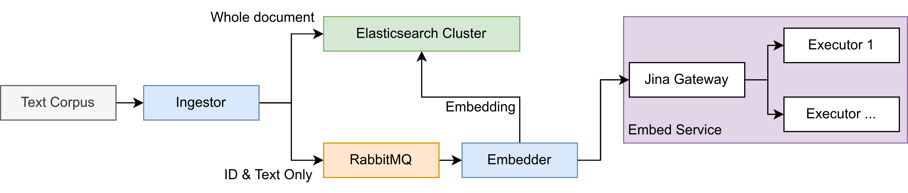

# GATE Neural Indexer

## Architecture

Fundamentally, the service reads documents from an on-disk data source, and ingests them into Elasticsearch with an embedding produced by a transformer model.

Considering some files we ingest are upwards of 30 million documents long, the embedding process can take time in the order of weeks. Logstash's ability to resume position in long files is not completely trustworthy, so it's in the interest for reliable embedding to ingest as quickly as possible.

In this ingester, we make the embedding process asynchronous, ingesting documents immediately without embedding, then using a queue to store un-embedded documents.



### Embedding Service

The subgraph bordered in green in the diagram above is the part of the service responsible for actually producing the embeddings. It uses [Jina](https://github.com/jina-ai/jina) to provide an inference service, which supports replication, monitoring, and a variety of other useful features.

Since the specifics of this service (number of replicas, GPU usage etc) will widely vary between development and production deployments, this part of the project is orchestrated separately (see [step 2 of setup](#2-defining-embedding-service)).

## Setup

This project is a (relatively) standard Docker Compose project, with a few quirks.

### 0. Prerequisites

You will need:
* Docker and Docker Compose installed
    * If you want to GPU-accelerate the embedder, you will also need the [Nvidia Container Runtime](https://docs.docker.com/config/containers/resource_constraints/#gpu)
* A `vm.max_map_count` configured to at least 262,144 - see the [Elasticsearch docs](https://www.elastic.co/guide/en/elasticsearch/reference/8.4/docker.html#_set_vm_max_map_count_to_at_least_262144) for instructions


Additionally, consider the following warnings:

* Docker uses `/var/lib/docker` as its default data storage directory, which on most systems will be on your boot drive. You will likely be storing a **significant** quantity of data in Elasticsearch, so the boot disk may not be sufficient. To change this, you will need to modify the [Docker daemon's configuration](https://docs.docker.com/config/daemon/systemd/).
* You should configure a way of backing up your Elastic instance. See the [Snapshot and Restore](https://www.elastic.co/guide/en/elasticsearch/reference/8.4/snapshot-restore.html) documentation.

If you wish to customise the embedding service, you will also need:

* Python 3.9 and [Pipenv](https://pipenv.pypa.io/en/latest/)

### 1. Preparing Environment

Copy `.env.example` to `.env` and complete the missing variables
* The `KIBANA_` and `ELASTIC_` passwords should be set securely now, as they are passed to other services so cannot be changed whilst running. Actual users can be created using the `elastic` superuser later.
* `LOGSTASH_INGEST` should be a path to a directory that will contain the files to ingest - either absolute or relative to the root directory.
* If you wish to use a GPU-accelerated embedder, set `EXECUTOR_GPU` to the ID of the GPU to use

> **Warning**
> It is **strongly advised** that the `LOGSTASH_INGEST` directory is empty until the system is online and healthy.
>
> Therefore, we suggest creating a directory for data storage (e.g. `/data/mydocs`) and an empty subdirectory for ingest (e.g. `/data/mydocs/ingest`). The outer directory stores all data to be ingested, and the inner directory is used for `LOGSTASH_INGEST`. Then, data files can easily be moved into it when ready to ingest.

### 2. Defining Embedding Service 

The [embedding service](#embedding-service) can be configured to use replicas, GPUs or CPU. These configurations are automatically generated, so are in a separate Docker Compose file.

* Some profiles are provided in `embedder/profiles`
* Additional profiles can be made using `pipenv run embedder/compose_generator.py` (see `--help` for arguments). Profiles you create are stored in `embedder/profiles/user`

These environments contain services and overrides for the top-level Docker Compose file, so **all Docker Compose commands must be run with them [merged](https://docs.docker.com/compose/extends/)**, not separately.

To run a given Docker Compose command with the merged files, run: (substituting `PROFILE` for your selected profile)

```sh
$ docker compose -f docker-compose.yml -f embedder/PROFILE.yml <command> 
```

However, this is very unwieldly, particularly because you must subsitute the correct profile each time.

To simplify this, a helper script is provided which automatically runs Docker Compose with the correct `-f` arguments.

1. Choose the environment with `./dc set-profile PROFILE`
    * Profile should be the name of the yml file, without extension - e.g. `./dc set-profile dev` for `embedder/profiles/dev.yml`
    * User profiles take precedence over system profiles, so `./dc set-profile dev` will use `embedder/profiles/user/dev.yml` (if it exists) over `embedder/profiles/dev.yml`
2. Run the helper with normal Compose arguments:
```sh
$ ./dc <command>
```

#### 2.1 Changing Embedder Model

The embedder uses [`sentence-transformers/distiluse-base-multilingual-cased-v2`](https://huggingface.co/sentence-transformers/distiluse-base-multilingual-cased-v2) by default. This can be changed in the `.env` file for any Huggingface Transformer model.

The embedder adds an integer version field to documents, specified by the `EMBEDDING_VERSION` environment variable. This can be incremented to distinguish between different versions of embeddings if the model is changed after some documents have been embedded. Currently there is no way to automatically re-queue outdated versions of documents for embedding.

### 3. Start Project
1. Run `./dc up -d` to bring up containers
2. Use `./dc watch-health` to live-refresh the health, or `./dc live-logs` to follow the system logs
3. Once Kibana is ready, go to `localhost:5601/kibana` and log in with the elastic credentials set in `.env` and go to the Stack monitoring page. It will take a few minutes for Metricbeat to start sending logs from the Elasticsearch cluster and Logstash instances, so wait and check they're all ready.

### 4. Begin Ingesting

> **Note**
> An example dataset can be downloaded from [here](https://drive.google.com/file/d/1dBwvLzKAr4XCwFZCT7hp4yNMw8khc-zp/view?usp=sharing). Use a multilingual model for this dataset.

To ingest, place content in the directory specified in the `.env` file.

Files should be in one or more JSON files (optionally gzipped), with one JSON document per line. Documents are expected to be in the format of:

* `doc_id`: A unique ID for the document
* `text`: The text of the document to embed
* and any other fields, which will be stored in Elasticsearch unchanged

This format can be modified by altering the logstash ingest config. For an example of a custom config, see `logstash/ingest/pipeline/ingest-gatetweet.conf`.

A dashboard called "Tweet Ingest Overview" is automatically created in Kibana, which displays information about the progress of the ingest.

### 5. Search Index

Kibana can be accessed at `localhost:5601/kibana` (note the suffix) with the user `elastic` and the password defined by `ELASTIC_PASSWORD`, however it cannot perform vector queries.

Instead, a custom search interface is provided at `localhost:8080`, using the credentials set by `SEARCH_USERNAME` and `SEARCH_PASSWORD`. A query document can be entered, and the parameters of the approximate-kNN search adjusted using the controls. It is currently not possible to filter results, as Kibana is unable to alter the properties of an approximate kNN search itself. Please note that each search creates a saved object in the form "UI Search YYYY-MM-DD HH:MM:SS.ssssss", you may wish to purge these periodically.

The same credentials as the search interface can also be used to access the full Kibana interface read-only at `localhost:8080/kibana`.

> **Note**
> The hit count shown in the Kibana UI is innacurate. The actual number of hits will be the `k` value set in the search UI.

<details>
<summary>Why does it create saved objects for each search?</summary>

<blockquote>
As of writing, Kibana does not support approximate kNN searches. With the old exact kNN method, Kibana could be 'tricked' into performing one. Since the search was performed by a script query, Kibana could just be fed the query object in the URL, and it would display it in JSON form in the search box but still do the search.

The approximate method is configured by the `knn` key, which is a sibling to `query`. Kibana is unaware this key exists, but if a saved search contains it, it will be passed to Elastic unmodified. So, by manually creating saved searches with the `knn` key, we can get Kibana to perform them, even if it's unaware of it.

The downside of this method is that you cannot then additionally filter the results, because filters on approximate kNN queries must be passed as part of the kNN query options (to ensure `k` results are actually returned).

This can all be avoided if you search the Elastic index via its API, so we would suggest using that for any serious searching.
</blockquote>
</details>

## Usage & Copyright
If you use this software in your research or work, please let me know at [frheppell1@sheffield.ac.uk](mailto:frheppell1@sheffield.ac.uk). Contributions are welcome, please make a pull request.

> Copyright (C) 2023-23 Freddy Heppell and The University of Sheffield.
>
> This program is free software: you can redistribute it and/or modify
it under the terms of the GNU Affero General Public License as published
by the Free Software Foundation, either version 3 of the License, or
(at your option) any later version.
>
>This program is distributed in the hope that it will be useful,
but WITHOUT ANY WARRANTY; without even the implied warranty of
MERCHANTABILITY or FITNESS FOR A PARTICULAR PURPOSE.  See the
GNU Affero General Public License for more details.
> You should have received a copy of the GNU Affero General Public License
along with this program.  If not, see <https://www.gnu.org/licenses/>.

