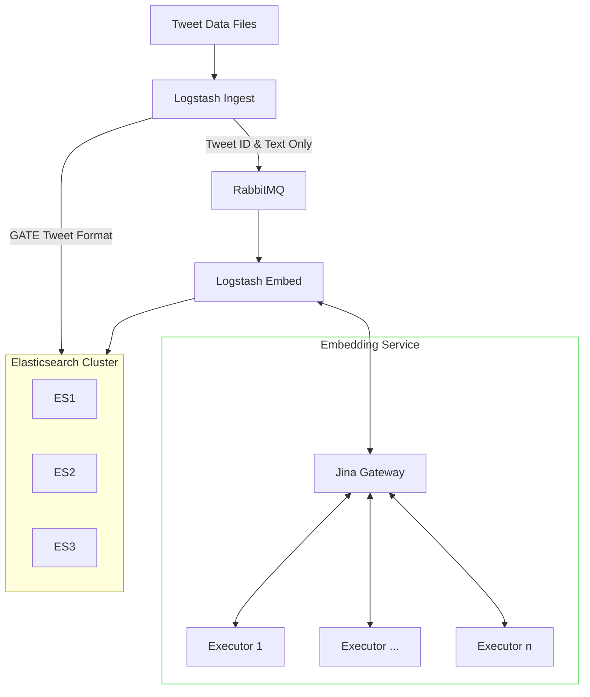

# Tweet Ingester

## Architecture

Fundamentally, the ingester reads tweets from an on-disk data source, and ingests them into Elasticsearch with an embedding produced by a transformer model.

Considering some files we ingest are upwards of 30 million tweets long, the embedding process can take time in the order of weeks. Logstash's ability to resume position in long files is not completely trustworthy, so it's in the interest for reliable embedding to ingest as quickly as possible.

In this ingester, we make the embedding process asynchronous, ingesting tweets immediately without embedding, then using a queue to store un-embedded tweets.



### Embedding Service

The subgraph bordered in green in the diagram above is the part of the service responsible for actually producing the embeddings. It uses [Jina](https://github.com/jina-ai/jina) to provide an inference service, which supports replication, monitoring, and a variety of other useful features.

Since the specifics of this service (number of replicas, GPU usage etc) will widely vary between development and production deployments, this part of the project is orchestrated separately.

## Setup

This project is a (relatively) standard Docker Compose project, with a few quirks.

### 0. Prerequisites

You will need:

* An installation of Docker
* Python (>=3.8) and [Pipenv](https://pipenv.pypa.io/en/latest/)
    * This is only used for some orchestration, not the application itself

### 1. Preparing Environment

Copy `.env.example` to `.env` and complete the missing variables
* The `KIBANA_` and `ELASTIC_` passwords should be set securely now, as they are passed to other services so cannot be changed whilst running. Actual users can be created using the `elastic` superuser later.
* `LOGSTASH_INGEST` should be a path to a directory that will contain the files to ingest - either absolute or relative to the root directory.

> **Warning**
> It is **strongly advised** that the `LOGSTASH_INGEST` directory is empty until the system is online and healthy, and that data is moved into it file-by-file.
>
> Therefore, we suggest creating a directory for data storage (e.g. `/data/tweets`) and an empty subdirectory for ingest (e.g. `/data/tweets/ingest`). The outer directory stores all data to be ingested, and the inner directory is used for `LOGSTASH_INGEST`. Then, data files can easily be moved into it when ready to ingest.

### 2. Defining Embedding Service 

The [embedding service](#embedding-service) can be configured to use replicas, GPUs or CPU. These configurations are automatically generated, so are in a separate Docker Compose file.

* Some profiles are provided in `embedder/profiles`
* Additional profiles can be made using `pipenv run embedder/compose_generator.py` (see `--help` for arguments). Profiles you create are stored in `embedder/profiles/user`

These environments contain services and overrides for the top-level Docker Compose file, so **all Docker Compose commands must be run with them [merged](https://docs.docker.com/compose/extends/)**, not separately.

To run a given Docker Compose command with the merged files, run: (substituting `PROFILE` for your selected profile)

```sh
$ docker compose -f docker-compose.yml -f embedder/PROFILE.yml <command> 
```

However, this is very unwieldly, particularly because you must subsitute the correct profile each time.

To simplify this, a helper script is provided which automatically runs Docker Compose with the correct `-f` arguments.

1. Choose the environment with `./dc set-profile PROFILE`
    * Profile should be the name of the yml file, without extension - e.g. `./dc set-profile dev` for `embedder/profiles/dev.yml`
    * User profiles take precedence over system profiles, so `./dc set-profile dev` will use `embedder/profiles/user/dev.yml` (if it exists) over `embedder/profiles/dev.yml`
2. Run the helper with normal Compose arguments:
```sh
$ ./dc <command>
```

### 3. Start Project


1. Run `./dc up -d` to bring up containers
2. Use `./dc watch-health` to live-refresh the health, or `./dc live-logs` to follow the system logs
3. Once Kibana is ready, log in with the elastic credentials set in `.env` and go to the Stack monitoring page. It will take a few minutes for Metricbeat to start sending logs from the Elasticsearch cluster and Logstash instances, so wait and check they're all ready.

### 4. Begin Ingesting

To ingest, place content in the directory specified in the `.env` file.